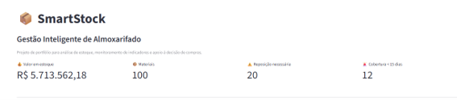
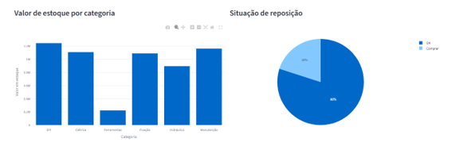
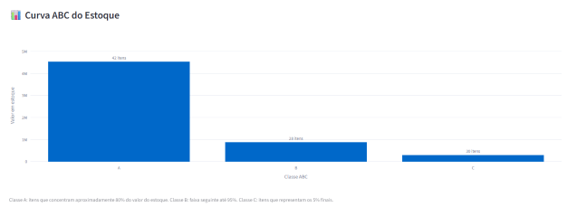
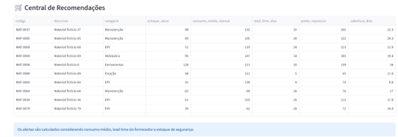
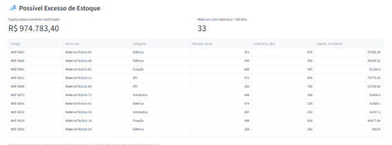
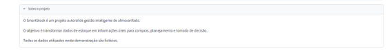

# 📦 SmartStock

## Gestão Inteligente de Almoxarifado

O **SmartStock** é um projeto autoral desenvolvido para demonstrar como dados de estoque podem ser transformados em informações úteis para apoiar decisões de compras, controle de materiais e gestão de capital.

O projeto foi inspirado em desafios observados em ambientes reais de almoxarifado, utilizando exclusivamente **dados fictícios gerados para demonstração**.

---

## 📊 Demonstração do Dashboard

### Visão Geral



O painel apresenta uma visão executiva do estoque, incluindo:

- valor total armazenado;
- quantidade de materiais cadastrados;
- materiais que necessitam de reposição;
- itens com baixa cobertura de estoque.

---

### 💰 Valor do Estoque por Categoria



A análise permite identificar em quais categorias está concentrado o capital investido em estoque, facilitando a identificação de grupos com maior impacto financeiro.

---

### 📊 Curva ABC



Os materiais são classificados de acordo com sua participação no valor total do estoque:

- **Classe A:** itens que concentram aproximadamente 80% do valor;
- **Classe B:** faixa seguinte até aproximadamente 95%;
- **Classe C:** parcela restante.

A Curva ABC ajuda a direcionar maior atenção aos materiais com maior impacto financeiro.

---

### 🛒 Central de Recomendações



O SmartStock não se limita à visualização dos dados. O sistema aplica regras de negócio para apoiar decisões de reposição.

O ponto de reposição considera:

- consumo médio do material;
- lead time do fornecedor;
- estoque de segurança.

A lógica utilizada no MVP é:

```text
Ponto de Reposição =
(Consumo Médio Diário × Lead Time)
+ Estoque de Segurança
```

Quando o estoque atual atinge ou fica abaixo do ponto de reposição, o material é sinalizado para análise de compra.

---

### 💤 Análise de Excesso de Estoque



O sistema também identifica materiais com cobertura muito superior à necessidade estimada.

No MVP, materiais com cobertura superior a **180 dias** são sinalizados para análise gerencial.

Isso permite identificar situações de possível:

- excesso de estoque;
- baixa movimentação;
- capital imobilizado;
- necessidade de revisão das políticas de compra.

---

## 🎯 Problema

A gestão de almoxarifados pode enfrentar desafios como:

- baixa visibilidade sobre os níveis de estoque;
- compras realizadas tarde demais;
- excesso de materiais armazenados;
- capital imobilizado;
- dificuldade para identificar materiais prioritários;
- diferenças no prazo de entrega dos fornecedores;
- ausência de indicadores para apoio à decisão.

O SmartStock foi concebido como uma solução para transformar esses dados operacionais em **informações úteis para tomada de decisão**.

---

## 🧠 Inteligência aplicada ao estoque

A proposta do SmartStock é ir além de um sistema tradicional de cadastro e movimentação.

A aplicação busca responder perguntas como:

> **Quais materiais precisam ser comprados?**

> **Quanto capital está armazenado em estoque?**

> **Quais itens possuem maior relevância financeira?**

> **Por quantos dias o estoque atual consegue atender ao consumo?**

> **Quais materiais podem estar mantendo capital desnecessariamente imobilizado?**

Dessa forma, dados de estoque são transformados em indicadores e recomendações gerenciais.

---

## 🛠️ Tecnologias utilizadas

- **Python** — desenvolvimento e regras de negócio;
- **Pandas** — tratamento e análise dos dados;
- **NumPy** — geração e manipulação de dados;
- **Streamlit** — construção da aplicação web;
- **Plotly** — visualização interativa;
- **Git** — controle de versão;
- **GitHub** — versionamento e documentação do projeto.

---

## 🗂️ Estrutura do projeto

```text
smartstock/
│
├── assets/
│   ├── smartstock-cabecalho.png
│   ├── smartstock-valor-categoria.png
│   ├── smartstock-curva-abc.png
│   ├── smartstock-recomendacoes.png
│   ├── smartstock-excesso.png
│   └── smartstock-sobre-projeto.png
│
├── database/
│   ├── gerar_dados.py
│   └── materiais.csv
│
├── docs/
│   └── visao-do-projeto.md
│
├── frontend/
│   └── app.py
│
├── .gitignore
├── README.md
└── requirements.txt
```

---

## 🧪 Dados utilizados

Todos os dados presentes neste repositório são **fictícios**.

A base foi gerada programaticamente em Python para simular um cenário de almoxarifado contendo:

- materiais;
- categorias;
- quantidades em estoque;
- custos unitários;
- consumo médio;
- lead time.

Nenhuma informação confidencial ou dado pertencente a empresas reais é utilizado.

---

## 🗺️ Roadmap

O SmartStock está sendo desenvolvido de forma incremental.

Entre as funcionalidades planejadas estão:

- inventário físico por QR Code;
- base transitória para contagens de inventário;
- aprovação de divergências antes da alteração do estoque oficial;
- rastreamento de materiais retirados para serviços externos;
- controle de devoluções;
- histórico de movimentações;
- análise de desempenho de fornecedores;
- previsão de demanda;
- alertas inteligentes;
- API de integração.

---

## 👩‍💻 Sobre o projeto



Este projeto faz parte do meu portfólio profissional e reúne conhecimentos de:

- análise de dados;
- desenvolvimento em Python;
- indicadores de negócio;
- gestão de estoque;
- modelagem de regras de negócio;
- visualização de dados;
- versionamento com Git.

O desenvolvimento está sendo realizado de forma incremental, priorizando inicialmente um **MVP funcional** e posteriormente a evolução da arquitetura e das funcionalidades.